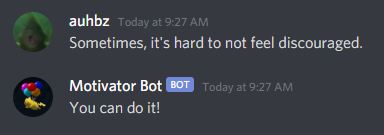
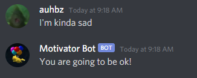
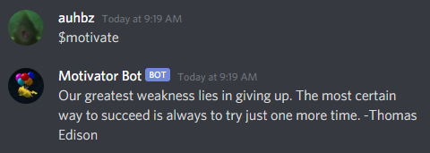
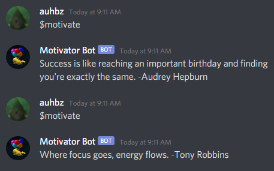
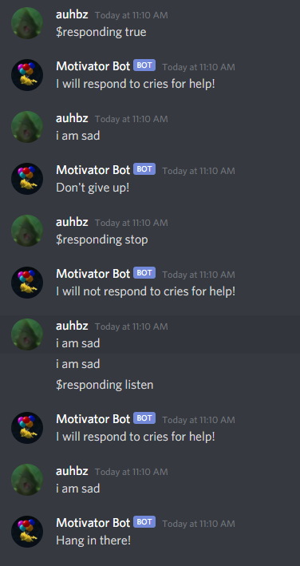
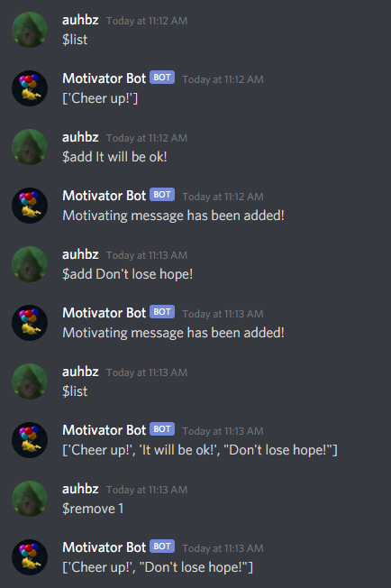
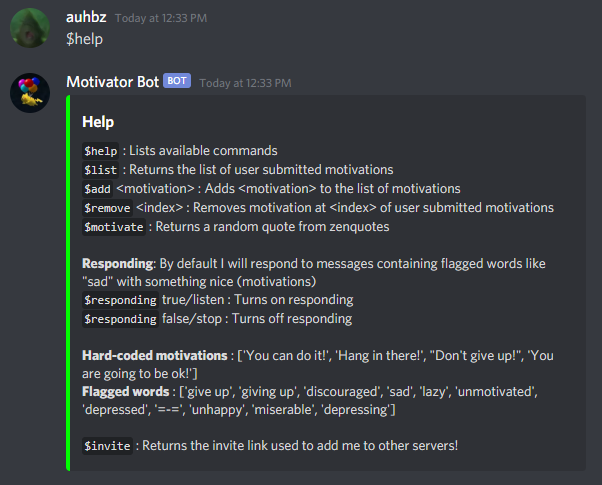

# MotivatorDiscordBot

The bot responds to words flagged as cries for help.
It will also pull a random quote from the zenquotes api when prompted with the `$motivate` command.

A few examples:

The 'flagged words' responses can be toggled on and off by the user with the `$responding` command.

Users can also manage a list of motivating messages which the bot will use in conjunction with the hardcoded list.

Finally, here is the `$help` command which lists out all available commands

Note: For reference, I used a freecodecamp.org tutorial to do a decent amount of this.
